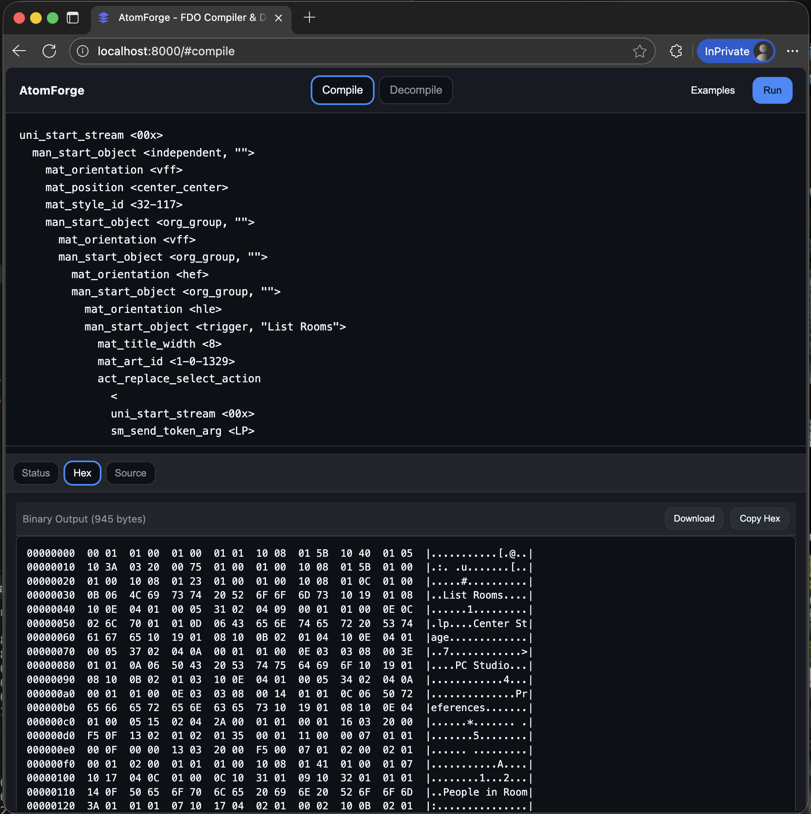

# AtomForge

A powerful FDO compilation toolkit that converts text-based FDO definitions into optimized binary formats using the Ada32.dll compilation engine. Deployed as a containerized web service with REST API and browser interface.

## Screenshots



*AtomForge provides a modern web interface for FDO compilation with real-time results and interactive API documentation.*

## Overview

AtomForge is a hacker's toolkit for FDO (Form Definition Object) compilation, using the real Ada32.dll library through Wine containerization. It transforms FDO source code into binary streams with a clean web interface and REST API for automation.

## Features

- **Web Interface** - Clean browser-based UI for FDO compilation
- **HTTP REST API** - Programmatic access with JSON interface
- **Docker Deployment** - Single-command containerized deployment
- **Cross-Platform Support** - Works on macOS (ARM64), Linux, and Windows
- **Real Compilation** - Uses actual Ada32.dll for binary output compatibility

## Quick Start

### Prerequisites

- Docker and Docker Compose
- Git

### Deployment

Deploy AtomForge with a single command:

```bash
# Clone the repository
git clone https://github.com/iconidentify/atomforge.git
cd atomforge

# Start AtomForge
docker-compose up --build
```

AtomForge is now running with:
- **Web Interface**: http://localhost:8000
- **API Documentation**: http://localhost:8000/api
- **Health Check**: http://localhost:8000/health

The container automatically includes:
- Wine environment with Ada32.dll
- Python API server with FastAPI
- Modern web interface with drag-drop file support
- Binary download capabilities
- All dependencies pre-configured

### API Integration

```bash
# Compile via HTTP POST
curl -X POST http://localhost:8000/compile \
  -H "Content-Type: application/json" \
  -d '{"source": "uni_start_stream <00x>\n  man_start_object <independent, \"Test\">\n  man_end_object <>\nuni_end_stream <>"}' \
  --output compiled.fdo

# Check service health
curl http://localhost:8000/health
```

## Architecture

### Core Components

- **Ada32.dll** - Original FDO compilation library (239KB)
- **atomforge.exe** - C-based compilation executable
- **Wine Environment** - Windows emulation for cross-platform compatibility
- **Docker Container** - Isolated compilation environment
- **FastAPI Server** - REST API and web interface layer

### Directory Structure

```
atomforge/
├── api/                        # HTTP REST API service
│   ├── src/
│   │   ├── api_server.py       # FastAPI server
│   │   └── fdo_compiler.py     # Compiler interface module
│   ├── static/                 # Web interface assets
│   │   ├── index.html          # Main web UI
│   │   ├── script.js           # Frontend JavaScript
│   │   └── style.css           # UI styling
│   └── requirements.txt        # Python dependencies
├── bin/                        # Executables and libraries
│   ├── atomforge.exe           # Main compiler executable
│   └── dlls/
│       ├── Ada32.dll           # Core compilation library
│       ├── Ada.bin             # Token definitions
│       └── GIDINFO.INF         # Configuration
├── build_tools/                # Docker build configuration
│   ├── Dockerfile              # Container definition
│   └── docker-compose.yml      # Service orchestration
├── golden_tests_immutable/     # Reference test data
├── src/                        # Source code
│   └── atomforge.c             # Main compiler source
├── Dockerfile                  # Container definition
└── docker-compose.yml          # Service orchestration
```

## File Formats

### Input: FDO Source (.txt)
```
uni_start_stream <00x>
  man_start_object <independent, "Test Room">
    mat_object_id <test-001>
    mat_orientation <vcf>
    mat_position <center_center>
  man_end_object <>
uni_end_stream <>
```

### Output: Binary Stream (.fdo)
Compiled binary format generated by Ada32.dll, typically containing optimized form definitions for runtime execution.

## Development

### Local Development

For development work, you can run the API server locally:

```bash
cd api
python3 -m venv venv
source venv/bin/activate
pip install fastapi uvicorn
ENV=development PORT=8001 python -m src.api_server
```

### Building from Source

The Docker container automatically builds the Wine environment and configures Ada32.dll. No manual compilation steps are required.

### Testing

Use the reference data in `golden_tests_immutable/` directory to validate compilation output against known-good binary files.

### Advanced Docker Usage

For debugging or advanced usage:

```bash
# Run interactive shell in container
docker-compose run --rm atomforge bash

# Inside container, compile manually
wine bin/atomforge.exe input.txt output.fdo
```

## Configuration

### Environment Variables

- `PORT` - API server port (default: 8000)
- `HOST` - API server host (default: 0.0.0.0)
- `ENV` - Environment mode (development/production)

### Docker Configuration

The system uses a Linux AMD64 container with Wine for Ada32.dll compatibility. Platform specification in docker-compose.yml ensures consistent behavior across ARM64 and x86_64 hosts.

## Troubleshooting

### Common Issues

1. **Docker Build Failures** - Ensure Docker has sufficient memory (4GB+ recommended)
2. **Wine Issues** - Container automatically initializes Wine environment
3. **Permission Errors** - Ensure proper file permissions for input/output directories
4. **Port Conflicts** - Change PORT environment variable if 8000 is in use

### Compilation Errors

- Verify FDO syntax matches expected format
- Check for special characters that need escaping
- Ensure input files are UTF-8 encoded

## License

This project is licensed under the MIT License - see the [LICENSE](LICENSE) file for details.

**Third-Party Components:** This software utilizes Ada32.dll and related components for FDO compilation. Users are responsible for ensuring compliance with any applicable licenses for these third-party components when using this software.